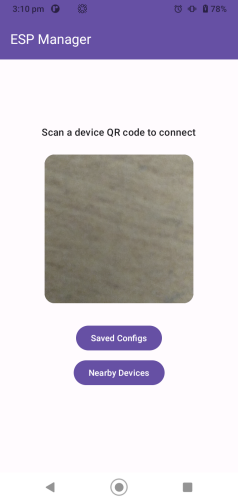
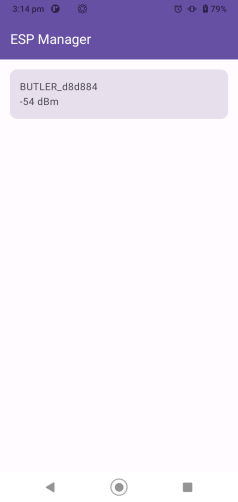
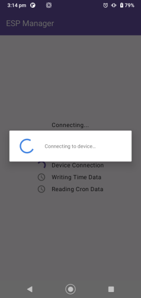
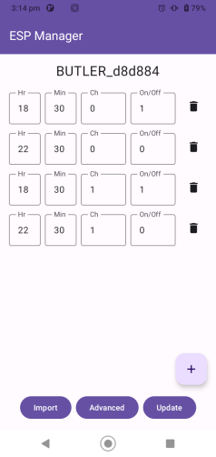
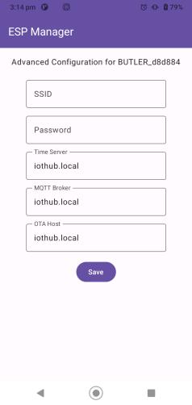
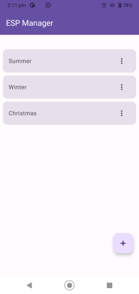
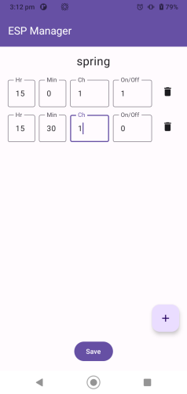

# espManager
Android app to manage a fleet of esp devices. Users can either manage/configure the devices locally or can provision them to connect to an iot broker. We use the espressif provisioning library. This can be used as a modern Kotlin alternative to the Espressif's Java App 'ESP SoftAP Prov'

## App Screenshots

## Connecting to the esp device
We use WiFi provisioning. The ESP device creates a wifi hotspot. The SSID, pasword etc of the ESP device is captured in a factory provided QR code, with same format as that of the espressif provisioning library.

<verbose>

{"ver":"v1","name":"mySSID","password":"myPassword","pop":"myPoP","transport":"softap","security":"1"}

<verbose/>

## Device Behaviour
The app is built around the assumption that the device exposes following custom endpoints through the provisioning library
    * timeWr - To write current time to the device
    * cronRd - To read from device the cron configuration currently installed on device
    * cronWr - To write new cron configurations to the device
    * bcfgWr - To write the board URL configurations like NTP server, MQTT Broker, OTA server etc.

## Tests
The app was tested against an ESP8266 board running provisioning library.

## Documentation
AI generated documentation of the Espressif provisioning library on the android side is available in the docs folder **[ESP Provisioning Library for Android](docs/index.md)**
